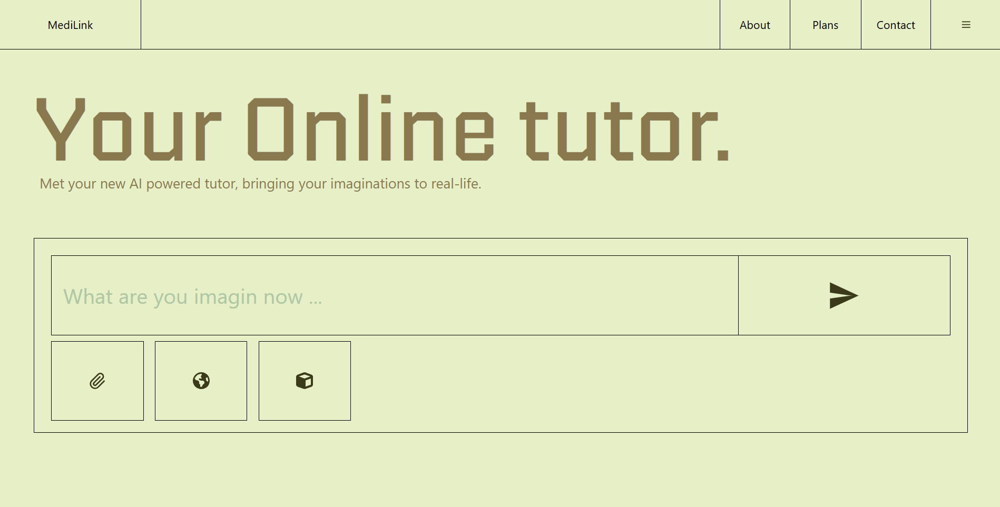

# Medilink

AI powerd Learning platform for enrich and clear the concept



## Installation / Setup ✨

1. First Clone
    ```bash
    git clone https://github.com/Sarthak-Kumbhar/Medilink.git
2. Set .env
    ```bash
    touch .env or create .env file in
3. ```bash
    VITE_GOOGLE_CLIENT_ID= # get google auth public id and paste in .env
4. Install Dependencies
    ```bash
    npm install
5. Finally Run 🎉
    ```bash
    npm run dev
## Backend Setup

1. ```bash
    cd ./backend  && npm install
    (or) cd ./backend then npm install
2. ```bash
    touch .env or create .env file in /backend
3. ```bash
    DB_URL= # Database URL
    PORT= # Port number
    HOST= # host mode
    JWT_SEC= # get jwt token jwt.io
    JWT_EX= # set expiry like 1h or 15min
    NODE_ENV= # set development or production

    copy all and paste in .env
4. ```bash
    finally 🎉

    npm run start